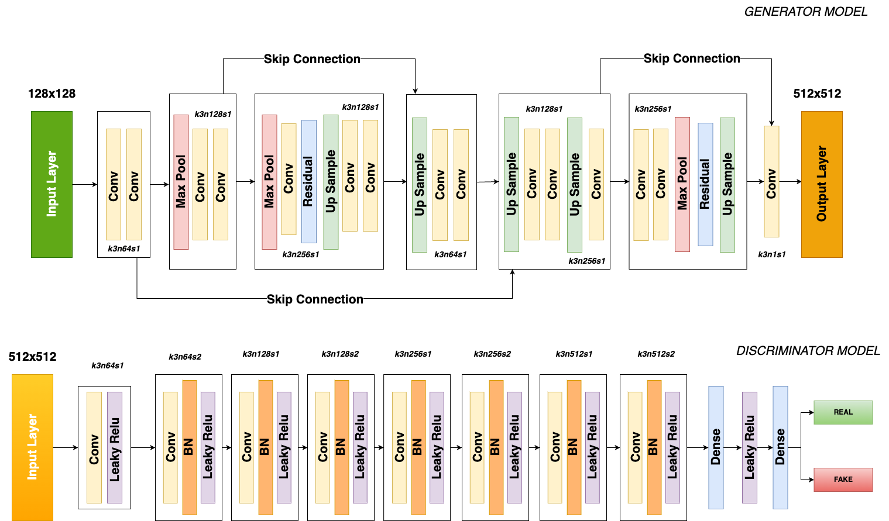
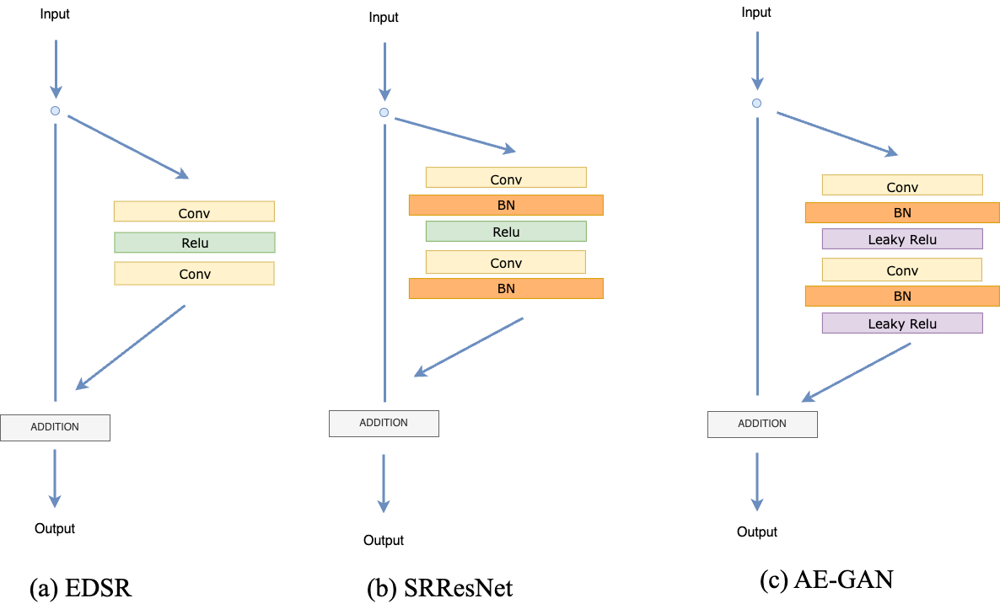
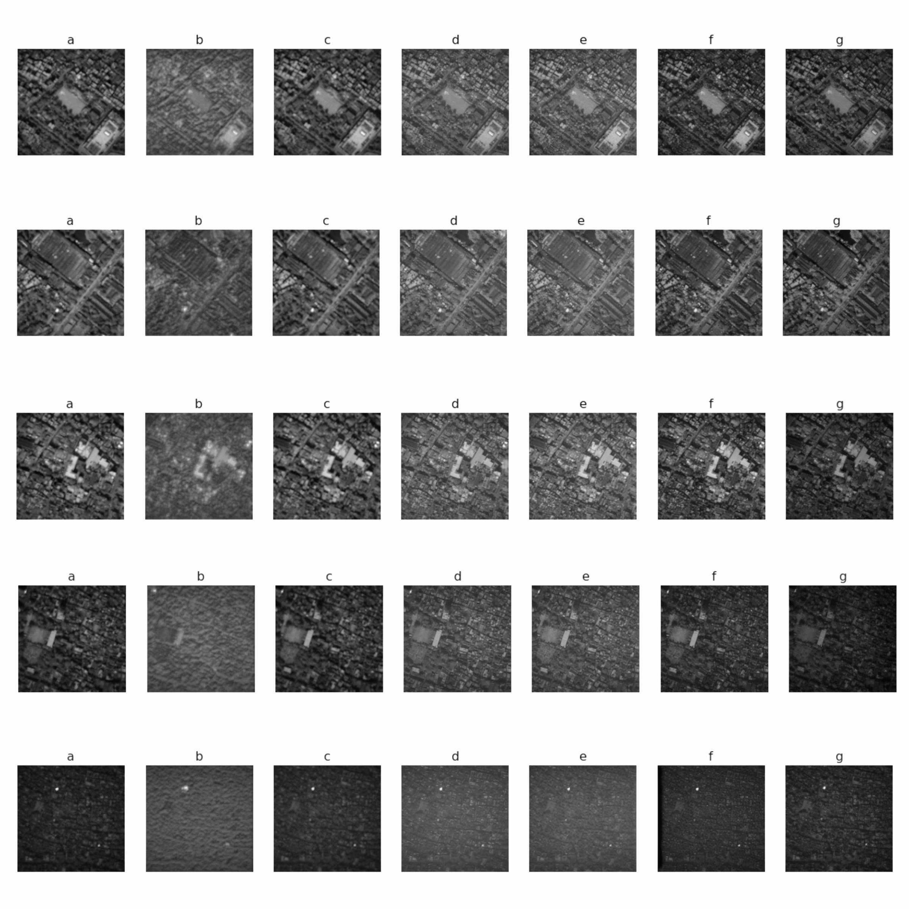
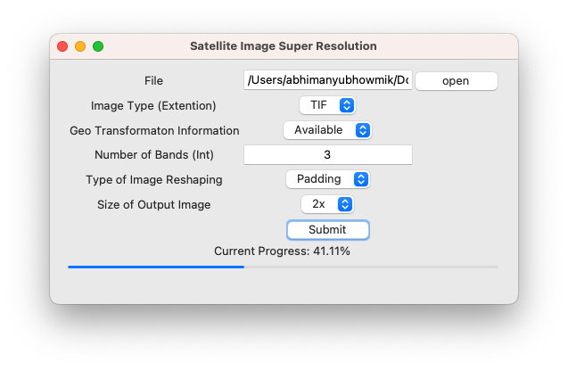
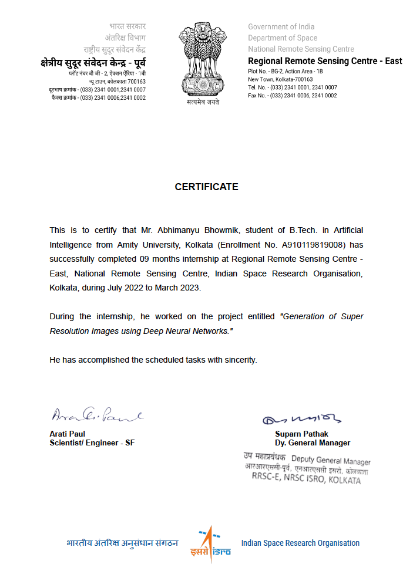

<h1 align="center">Generation of Super Resolution Images using
Deep Neural Networks</h1>

## Abstract:
Super Resolution Images are required to properly perceive the intricacies of any given image. Satellite imaging is one such domain where details of an image must be preserved extremely carefully since image quality decreases drastically at high magnification. Due to developments in the disciplines of computer vision and deep learning, super-resolution which tries to increase image resolution by computational means has advanced recently. Convolutional neural networks built on a range of architectures, such as autoencoders, generative adversarial networks, and residual networks, have been used to tackle the issue. Few studies concentrate on single or multi-band analytic satellite imaging, whereas the majority of research focuses on the processing of images with simply RGB colour channels. Super resolution is a highly important and significant operation that must be carried out carefully in the realm of remote sensing. This work proposes a cutting-edge architecture AutoEn-GAN for the super-resolution of satellite images by blending autoencoders with an adversarial setting. All of the models’ output is compared to the recently developed SR GAN, SR-ResNet, and EDSR models, and the traditional super-resolution benchmark using bicubic interpolation. Results of the AutoEn-GAN super-resolution method show a significant improvement over other state of the art methodologies such as SR-GAN. 

RRSC - East Campus (Newtown, Kolkata)

## Overall Framework

## Model :

AutoEn-GAN Model Architecture

Residual Block 

Model Training

## Results:

Sample patches of all images after transfer learning and training of the model(a) Input Image, (b) Bicubic Interpolation, (c) EDSR, (d) SR(PRE), (e) SR(GAN), (f) Proposed Model, (g) Original Image

Comparison of the matrices (A) PSNR Values, (B) SSIM Values, (C) RMSE Values

## AutoEn-GAN App:

## Internship Certificate:

  

## Quick Links:

 
 

 

## References Used:
- https://arxiv.org/abs/1609.04802
- https://arxiv.org/abs/1707.02921
- https://arxiv.org/abs/2203.09445
- https://www.uni-goettingen.de/de/document/download/e3004c6e53ca2fa0a30d53d98a52c24e.pdf/MA_Freudenberg.pdf
